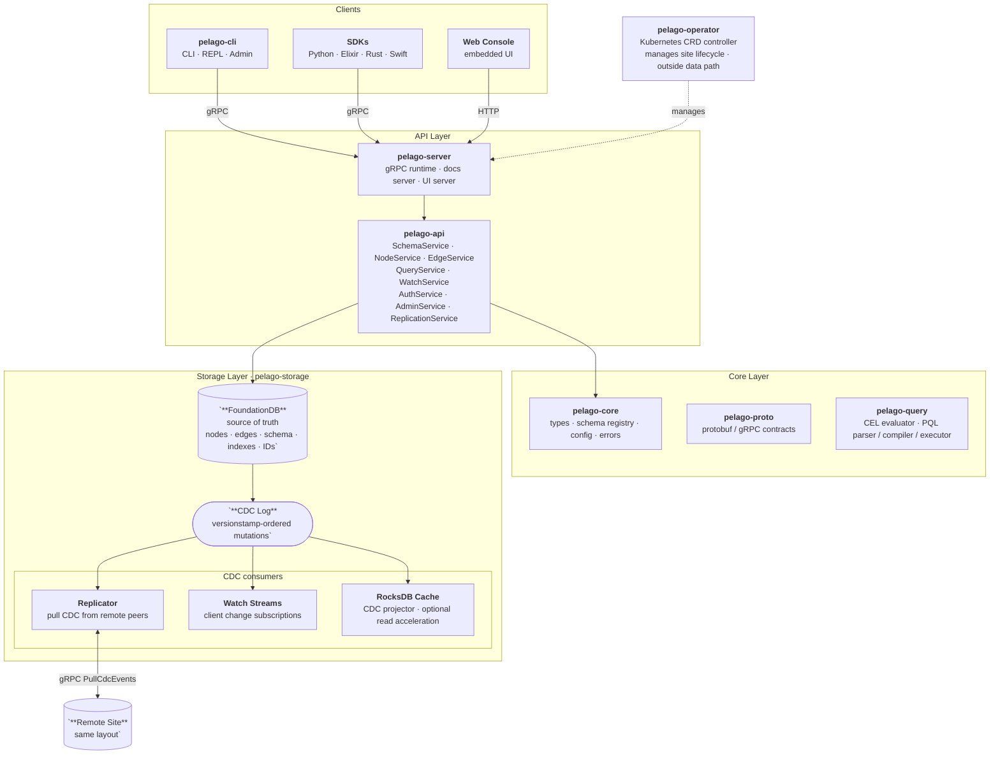

# PelagoDB
[](https://github.com/paxsonsa/pelagodb/actions/workflows/ci-gates.yml)

PelagoDB is a schema-first graph database built on FoundationDB for teams that need:
- strict data shape guarantees
- expressive graph querying
- CDC/event-driven integration
- multi-site replication with ownership controls
- operational security and auditability

It combines low-level durability/consistency from FoundationDB with high-level graph primitives and developer tooling (gRPC APIs, CLI, SDKs, datasets, and ops scripts).

## Quick Start (Local FDB)

### 1) Prerequisites
- Rust stable toolchain
- Python 3.10+ (for the SDK)
- FoundationDB client tools (`fdbcli`) and either:
  - a running local FoundationDB cluster, or
  - Docker (for test cluster via project script)

### 2) Start FoundationDB

Use an existing local cluster:
```bash
fdbcli --exec "status minimal"
```

Or start a local test cluster with Docker:
```bash
./scripts/start-fdb.sh
```

### 3) Start PelagoDB server
```bash
export PELAGO_FDB_CLUSTER=/usr/local/etc/foundationdb/fdb.cluster
# If you used Docker test cluster instead, use:
# export PELAGO_FDB_CLUSTER=./fdb.cluster

export PELAGO_SITE_ID=1
export PELAGO_SITE_NAME=local
export PELAGO_LISTEN_ADDR=127.0.0.1:27615
export PELAGO_AUTH_REQUIRED=false
export PELAGO_CACHE_ENABLED=true

cargo run -p pelago-server --bin pelago-server
```

### 4) Install the Python SDK
```bash
cd clients/python
python -m venv .venv
source .venv/bin/activate
pip install -e .
pip install -r requirements-dev.txt
./scripts/generate_proto.sh
```

### 5) Verify connectivity
```bash
cargo run -p pelago-cli -- --server http://127.0.0.1:27615 --database default --namespace default schema list
```

---

## Using the Python SDK

Once the server is running, the Python SDK is the fastest way to explore PelagoDB. It provides two API levels: a low-level **dict API** and a high-level **typed schema API**.

### Dict API — quick and direct

```python
from pelagodb import PelagoClient

client = PelagoClient("127.0.0.1:27615", database="default", namespace="demo")

# Register a schema
client.register_schema_dict({
    "name": "Person",
    "properties": {
        "name": {"type": "string", "required": True},
        "age":  {"type": "int", "index": "range"},
    },
    "edges": {
        "follows": {"target": "Person", "direction": "outgoing"},
    },
})

# Create nodes
alice = client.create_node("Person", {"name": "Alice", "age": 31})
bob   = client.create_node("Person", {"name": "Bob",   "age": 29})

# Create an edge
client.create_edge("Person", alice.id, "follows", "Person", bob.id)

# Query with CEL filter
for person in client.find_nodes("Person", "age >= 30", limit=20):
    print(person.id, person.entity_type)

client.close()
```

### Typed Schema API — define schemas as Python classes

The typed API gives you class-based schema definitions, operator-overloaded filters,
namespace scoping, and cross-namespace edges.

#### Define your schema

```python
from pelagodb import (
    PelagoClient, Namespace, Entity, Property, OutEdge, IndexType
)

class GlobalNamespace(Namespace):
    name = "global"

    class Vendor(Entity):
        name: str = Property(required=True, index=IndexType.EQUALITY)
        industry: str = Property()


class TenantNamespace(Namespace):
    name = "tenant_{tenant_id}"          # templated — call .bind() to resolve

    class Person(Entity):
        name: str   = Property(required=True, index=IndexType.EQUALITY)
        age: int    = Property(default=0, index=IndexType.RANGE)
        active: bool = Property(default=True)
        follows     = OutEdge("Person")
        supplied_by = OutEdge(GlobalNamespace.Vendor)   # cross-namespace edge
```

#### Register, create, and query

```python
client = PelagoClient("127.0.0.1:27615")

# Register schemas
client.register(GlobalNamespace)

acme = TenantNamespace.bind(tenant_id="acme")   # resolves to "tenant_acme"
client.register(acme)

# Namespace-scoped CRUD
global_ns = client.ns(GlobalNamespace)
vendor = global_ns.create(GlobalNamespace.Vendor(name="Acme Corp", industry="Tech"))

acme_ns = client.ns(acme)
alice   = acme_ns.create(acme.Person(name="Alice", age=31))
bob     = acme_ns.create(acme.Person(name="Bob",   age=29))
charlie = acme_ns.create(acme.Person(name="Charlie", age=25))

# Link nodes — same namespace and cross-namespace
client.link(alice, "follows", bob)
client.link(alice, "follows", charlie)
client.link(alice, "supplied_by", vendor)        # cross-namespace edge

# Point lookup
fetched = acme_ns.get(acme.Person, alice.id)
print(fetched)  # Person(id='...', ns='tenant_acme', name='Alice', age=31, active=True)

# Update
updated = acme_ns.update(alice, age=32)
print(updated.age)  # 32

# Filter with operator overloading
for p in acme_ns.find(acme.Person, acme.Person.age > 30):
    print(f"  {p.name} (age={p.age})")

# Query builder — compiles to PQL under the hood
results = (
    acme_ns.query(acme.Person)
    .filter(acme.Person.name == "Alice")
    .traverse(acme.Person.follows, filter=acme.Person.age > 25)
    .limit(20)
    .run()
)
for p in results:
    print(f"  {p.name}")

# Cleanup
client.unlink(alice, "follows", bob)
acme_ns.delete(charlie)
client.close()
```

#### Async watch streams

Watch for real-time changes. Breaking out of the loop automatically cancels the
stream and cleans up the server-side subscription:

```python
import asyncio
from pelagodb import WatchEventType

async def watch_changes():
    client = PelagoClient("127.0.0.1:27615")
    acme = TenantNamespace.bind(tenant_id="acme")
    acme_ns = client.ns(acme)

    async with acme_ns.watch_query(acme.Person, acme.Person.age > 30) as events:
        async for event in events:
            if event.type == WatchEventType.HEARTBEAT:
                continue
            print(event.type, event.node.name)

asyncio.run(watch_changes())
```

Three watch scopes are available:
- `watch_node(model, node_id)` — watch a specific node
- `watch_query(model, filter_expr)` — watch a query for result changes
- `watch()` — watch all changes in the namespace

### More examples

- `clients/python/examples/basic_crud.py` — dict-based CRUD
- `clients/python/examples/typed_crud.py` — typed schema with namespaces and cross-namespace edges
- `clients/python/examples/query_and_pql.py` — queries and PQL
- `clients/python/examples/auth_and_audit.py` — authentication and audit logging

---

## Architecture at a Glance

PelagoDB is organized into four layers inside each site. Cross-site replication is pull-based over gRPC — each site's replicator reaches out to peers rather than peers pushing in.



### Components

#### Clients

**`pelago-cli`** — The official command-line binary. Ships a full interactive REPL for PQL queries, plus subcommands for schema registration, node/edge CRUD, admin operations, and replication status checks.

**Client SDKs** (`clients/python`, `clients/elixir`, `clients/rust`, `clients/swift`) — Language-native wrappers around the gRPC API. Use these to integrate PelagoDB into application code without writing raw protobuf calls.

**Web Console (UI)** — An optional embedded web UI served by `pelago-server`. Includes a graph explorer, multi-tab query studio, schema browser, and ops dashboard. Built assets are served under `/ui/` when `PELAGO_UI_ENABLED=true`.

---

#### API Layer

**`pelago-server`** — The main gRPC server binary. Wires together all service handlers, owns the runtime lifecycle, and optionally starts the embedded docs server and UI server alongside the primary gRPC listener.

**`pelago-api`** — Service handler implementations. Each gRPC service lives here and coordinates between the core and storage layers:

| Service | Responsibility |
|---|---|
| `SchemaService` | Schema registration, validation, versioning |
| `NodeService` / `EdgeService` | CRUD with schema validation and indexing |
| `QueryService` | CEL `find`, PQL traversal, pagination |
| `WatchService` | Point / query / namespace change subscriptions |
| `AuthService` | Authentication tokens and identity |
| `AdminService` | Namespace lifecycle, retention, admin surfaces |
| `ReplicationService` | Exposes CDC stream to remote replicators |

---

#### Core Layer

**`pelago-core`** — Shared vocabulary for the whole system: type definitions, schema registry logic, server configuration, and error types. All other crates depend on this.

**`pelago-proto`** — Protobuf definitions and generated gRPC stubs. This is the API contract between all clients and the server. Changes here ripple outward to every SDK.

**`pelago-query`** — The query engine. Implements a CEL expression evaluator for property filtering (`find` queries) and a full PQL parser, compiler, and executor for graph-native traversal queries and the interactive REPL.

---

#### Storage Layer (`pelago-storage`)

**FoundationDB** — The transactional source of truth. Every node, edge, schema definition, index entry, and ID lives here. PelagoDB inherits FDB's strict serializability and multi-key ACID transactions.

**CDC Log** — A versionstamp-ordered log of every mutation, written atomically inside the same FDB transaction that commits the change. Three downstream consumers read from this single stream, which is why replication, watch, and caching all share consistent ordering semantics.

**Replicator** — A pull-based CDC worker. Connects to remote sites via `ReplicationService.PullCdcEvents`, reads events since its last checkpoint, applies them locally with ownership/LWW conflict policy, then mirrors successfully applied events back into the *local* CDC. This mirroring step is what keeps watch streams and the read cache coherent on receiving sites without each API node running its own pull loop.

**Watch Streams** — Pushes filtered CDC events to connected gRPC streams for `WatchPoint`, `WatchQuery`, and `WatchNamespace` subscriptions. Supports `resume_after` versionstamp so clients survive reconnects without missing events.

**RocksDB Cache** — An optional local read-acceleration layer. The CDC projector consumes the local CDC log (including events mirrored in by the replicator) and materializes node/edge state into RocksDB. Always derivative — FoundationDB is the system of record and the cache can be rebuilt at any time.

---

#### Operator

**`pelago-operator`** — A Kubernetes CRD controller that manages PelagoDB site lifecycle: creating deployments, configuring topology, handling rolling upgrades, and managing the split between API nodes and replicator workers. It sits outside the data path and never touches query or replication traffic directly.

## Why Pelago?
`Pelago` is a play on *archipelago*: a connected group of islands.

That maps directly to PelagoDB's multi-site model:
- each site is part of a larger cluster
- each site can remain operationally distinct
- ownership rules keep data independent where it should be independent
- replication keeps islands connected without collapsing them into one undifferentiated node

So the name reflects the core idea: connected, clustered systems with explicit locality and ownership boundaries.

## Why PelagoDB
- Schema-first graph model: enforce entity and edge contracts up front.
- Two query surfaces: CEL for filter/range style queries and PQL for graph-native query composition.
- Built-in CDC: watch streams, cache projection, and replication all flow from the same event backbone.
- Multi-site by design: pull-based CDC replication and owner-aware conflict handling.
- Global relationship modeling: relationships can cross tenant and namespace boundaries when your domain requires it.
- Partition-aware writes: preserve availability and writability, with explicit LWW handling for conflicting new-data creation paths.
- Operational controls: authn/authz/audit APIs plus retention and admin surfaces.

## Schema Registration Breaking Change
- `SchemaService.RegisterSchema` now requires:
  - `index_default_mode = INDEX_DEFAULT_MODE_AUTO_BY_TYPE_V1`
- Legacy schema writers that omit this mode are rejected with `INVALID_ARGUMENT`.
- When property `index` is omitted, the server infers defaults by type:
  - `int`, `float`, `timestamp` -> `range`
  - `bool` -> `equality`
  - `string`, `bytes` -> `none`
- Explicit `index: none` always overrides and disables inferred indexing for that property.

## Who Should Use PelagoDB
- Teams building globally distributed applications with cross-DC writes.
- Teams that need strict schema governance and explicit ownership controls.
- Teams that need graph relationships across tenant boundaries in one model.
- Teams comfortable operating replication, cache, watch, and security controls.

## Who Should Not Use PelagoDB
- Teams prioritizing minimal-ops managed graph experience above all else.
- Teams needing immediate deep compatibility with Cypher/Gremlin ecosystems.
- Teams unable to accept LWW resolution plus reconciliation for conflicting new-data creation under partition.
- Teams whose workload is mostly ad-hoc graph exploration with minimal governance requirements.

## Data Modeling Principles (Read Before First Schema)
- Keep `tenant`, `namespace`, and `ownership` as separate concepts.
- Use ownership to enforce mutation safety at the entity level.
- Use namespaces for operational partitioning and lifecycle control, not as a complete substitute for ownership.
- Model cross-tenant relationships intentionally, and review fanout/latency costs.
- Assume partition scenarios will happen and design create flows for deterministic conflict handling and reconciliation.

## Advanced Quick Start Options

### Config file
```bash
cp pelago-server.example.toml pelago-server.toml
cargo run -p pelago-server --bin pelago-server
# override from CLI when needed:
# cargo run -p pelago-server --bin pelago-server -- --site-id 2 --listen-addr 127.0.0.1:27616
```

### Multi-site topology (Docker Compose)
```bash
docker compose -f docker-compose.multisite.yml up --build -d
```
This boots:
- `site1-api` on `127.0.0.1:27615`
- `site2-api` on `127.0.0.1:27616`
- dedicated replicator workers for each site

### Load example datasets
```bash
python datasets/load_dataset.py social_graph --endpoint 127.0.0.1:27615 --database default --namespace demo
```
More: `datasets/README.md`

### Serve docs from running server
```bash
export PELAGO_DOCS_ENABLED=true
export PELAGO_DOCS_ADDR=127.0.0.1:4070
cargo run -p pelago-server --bin pelago-server
```
Open `http://127.0.0.1:4070/docs/`

### Embedded UI console
Build frontend assets once:
```bash
cd ui && npm install && npm run build && cd ..
```

Then start server with UI enabled:
```bash
export PELAGO_UI_ENABLED=true
export PELAGO_UI_ADDR=127.0.0.1:4080
export PELAGO_UI_ASSETS_DIR=ui/dist
cargo run -p pelago-server --bin pelago-server
```
Open `http://127.0.0.1:4080/ui/`

### Stop local test FDB (if started via Docker)
```bash
./scripts/stop-fdb.sh
```

## Quick Links
- Documentation hub: `docs/README.md`
- Getting started: `docs/getting-started/quickstart.md`
- Architecture: `docs/concepts/architecture.md`
- When to use PelagoDB: `docs/concepts/positioning.md`
- Data model: `docs/concepts/data-model.md`
- PQL reference: `docs/reference/pql.md`
- Schema specification: `docs/reference/schema-spec.md`
- CEL filters: `docs/reference/cel-filters.md`
- CLI reference: `docs/reference/cli.md`
- gRPC API: `docs/reference/grpc-api.md`
- Watch API: `docs/reference/watch-api.md`
- Replication: `docs/concepts/replication.md`
- Operations: `docs/operations/deployment.md`
- Kubernetes operator: `docs/operations/kubernetes-operator.md`
- Simulation/Fuzzing runbook: `docs/operations/simulation-fuzzing.md`
- Configuration: `docs/reference/configuration.md`
- Tutorials: `docs/tutorials/build-a-social-graph.md`
- API protocol: `proto/pelago.proto`
- CLI crate: `crates/pelago-cli`
- Server crate: `crates/pelago-server`
- Operator crate: `crates/pelago-operator`
- Client SDKs: `clients/README.md`
- Example datasets: `datasets/README.md`

## Production-Oriented Tooling
- CI/release gate script: `scripts/ci-gate.sh`
- Benchmark harness: `scripts/perf-benchmark.py`
- DR rehearsal: `scripts/dr-rehearsal.sh`
- Production env baseline: `scripts/production-env.example`

## Perf Gate Profiles (February 28, 2026)
The perf gate is split by transport to separate service-path latency from CLI process overhead:

- `grpc` transport (persistent channel, service latency gate): p99 targets
  - `node_get`: 6 ms
  - `query_find`: 12 ms
  - `query_traverse`: 100 ms
- `cli` transport (end-to-end regression gate): p99 targets
  - `node_get`: 40 ms
  - `query_find`: 35 ms
  - `query_traverse`: 100 ms

Provisioned S1-S6 CI runs both gates and emits:
- `.tmp/perf/<SCENARIO>-grpc.json`
- `.tmp/perf/<SCENARIO>-cli.json`
